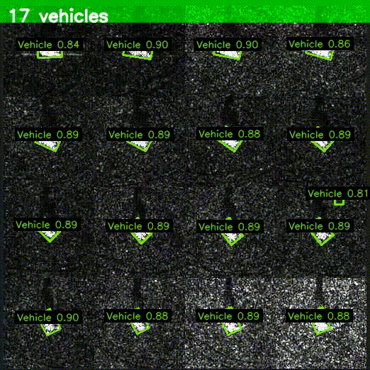

# SIVED: Vehicle Detection in SAR Imagery Using YOLOv8-OBB

<p align="center">
  
</p>

<p align="center">
  <strong>Fine-tuned YOLOv8m-OBB detecting vehicles in SAR imagery with oriented bounding boxes.</strong>
</p>

<p align="center">
  <a href="https://huggingface.co/datasets/Omarinooooo/SIVED">Dataset</a> &bull;
  <a href="https://github.com/CAESAR-Radi/SIVED">Original SIVED Repository</a> &bull;
  <a href="https://www.nature.com/articles/s41598-025-28755-3">Nature Scientific Reports</a> &bull;
  <a href="https://www.mdpi.com/2072-4292/15/11/2825">Remote Sensing (MDPI)</a>
</p>

---

## Table of Contents

- [Overview](#overview)
- [Dataset](#dataset)
- [Pipeline](#pipeline)
- [Exploratory Data Analysis](#exploratory-data-analysis)
- [Training Configuration](#training-configuration)
- [Results](#results)
- [Deployment](#deployment)
- [Project Structure](#project-structure)
- [Tools and Frameworks](#tools-and-frameworks)
- [Acknowledgments and Citations](#acknowledgments-and-citations)
- [License](#license)

---

## Overview

This project implements a complete, end-to-end pipeline for fine-tuning **YOLOv8m-OBB** (Oriented Bounding Box) on the **SIVED** (SAR Image Vehicle Detection) dataset. The pipeline covers every stage from raw data extraction through model deployment, achieving **98.8% mAP@0.5** on the held-out test set.

Synthetic Aperture Radar (SAR) imaging operates independently of weather, illumination, and cloud cover, making it invaluable for defense, disaster response, and surveillance applications. However, SAR imagery is inherently grayscale, affected by speckle noise, and lacks the color and texture cues that standard object detectors rely on. Vehicles in SAR scenes also appear at arbitrary orientations, requiring oriented bounding box representations rather than axis-aligned alternatives.

This work addresses these challenges through domain-specific augmentation strategies, careful preprocessing, and transfer learning from DOTAv1 pretrained weights to the SAR domain.

---

## Dataset

The **SIVED** dataset was introduced by **Lin et al. (2023)** and curated by the **CAESAR-Radi** research group.

| Property | Value |
|----------|-------|
| Total Images | 1,044 (512 x 512 px, grayscale) |
| Total Annotations | 12,013 oriented bounding boxes |
| Classes | 1 (Vehicle) |
| Annotation Format | DOTA (8-point rotated bounding box) |
| Train / Valid / Test | 837 / 104 / 103 images |

The dataset aggregates SAR imagery from three radar sources:

| Source | Organization | Band | Polarization | Resolution |
|--------|-------------|------|--------------|------------|
| FARAD | Sandia National Laboratory | Ka/X | VV/HH | 0.1m x 0.1m |
| MiniSAR | Sandia National Laboratory | Ku | - | 0.1m x 0.1m |
| MSTAR | U.S. Air Force | X | HH | 0.3m x 0.3m |

---

## Pipeline

The project follows a seven-step pipeline:

| Step | Description |
|------|-------------|
| 1. Data Extraction | Mount, extract, and verify image-label parity across all splits |
| 2. DataFrame Construction | Parse all 12,013 annotations into a unified Pandas DataFrame |
| 3. Exploratory Data Analysis | Nine sub-analyses covering distributions, geometry, and quality |
| 4. Data Cleaning | Five-stage cleaning: corrupt images, OOB annotations, degenerate boxes, difficulty flagging, orphan reconciliation |
| 5. Format Conversion | Convert DOTA absolute coordinates to YOLO OBB normalized format |
| 6. Model Fine-Tuning | Fine-tune YOLOv8m-OBB with SAR-specific augmentation |
| 7. Evaluation | Quantitative metrics, curves, confusion matrices, baseline comparison, and visual inspection |

---

## Exploratory Data Analysis

### OBB Area Distribution

Bounding box areas computed via the Shoelace formula. The distribution is right-skewed with the majority of annotations between 200 and 2,000 square pixels.

<p align="center">
  
</p>

### Orientation Distribution

Rotation angles extracted from the longest edge of each OBB. Strong peaks at 0 and 90 degrees confirm arbitrary vehicle orientations in SAR scenes, validating the need for oriented detection.

<p align="center">
  
</p>

### Annotations Per Image

Scene density analysis. Most images contain 1 to 20 vehicles, with a pronounced spike at 16-17 vehicles per image. Some dense scenes contain up to 60 annotated vehicles.

<p align="center">
  
</p>

### Sample Images with OBB Annotations

Twelve randomly selected images with oriented bounding box annotations overlaid. All annotations are difficulty=0 (easy) in this sample.

<p align="center">
  
</p>

---

## Training Configuration

**Model:** YOLOv8m-OBB (25.9M parameters), pretrained on DOTAv1.

| Parameter | Value | Rationale |
|-----------|-------|-----------|
| Optimizer | AdamW | Decoupled weight decay for stable fine-tuning |
| Learning Rate (initial) | 0.001 | Moderate rate for transfer learning |
| Learning Rate (final) | 0.01x initial | Cosine annealing schedule |
| Image Size | 640 px | Standard YOLO input resolution |
| Batch Size | 16 | Optimized for Tesla T4 (16GB VRAM) |
| Epochs | 100 (max) | With early stopping |
| Early Stopping Patience | 20 | Prevents overfitting on 837 training images |
| Warmup Epochs | 3 | Gradual learning rate ramp-up |
| Mosaic | 1.0 | Full mosaic augmentation for scene diversity |
| Copy-Paste | 0.2 | Instance-level augmentation for object density |
| Rotation | 15 degrees | Complements natural orientation diversity |
| HSV Hue | 0.0 | **Disabled** (SAR is grayscale) |
| HSV Saturation | 0.0 | **Disabled** (SAR is grayscale) |
| HSV Value | 0.4 | Intensity variation to simulate SAR contrast differences |

**Key design decisions:**
- Hue and saturation augmentations were explicitly disabled because SAR images contain no color information. Applying color-space perturbations would introduce meaningless noise.
- The value channel augmentation (0.4) simulates the natural intensity variations observed across different SAR acquisition conditions and radar bands.
- Rotation augmentation of 15 degrees complements the broad orientation distribution already present in the dataset.

Training converged at approximately epoch 50, with early stopping triggered at epoch 70.

---

## Results

### Test Set Metrics

| Metric | Value |
|--------|-------|
| mAP@0.5 | 0.988 |
| mAP@0.5:0.95 | 0.816 |
| Precision | 0.970 |
| Recall | 0.979 |

### Precision, Recall, PR, and F1 Curves

<p align="center">
  
</p>

- **F1 Peak:** 0.97 at confidence threshold 0.494
- **Precision:** Reaches 1.0 at confidence > 0.95
- **PR AUC:** 0.988

### Confusion Matrix

<p align="center">
  
</p>

- True Positives: 1,219
- False Positives: 64
- False Negatives: 11
- Normalized Recall: 0.99 (miss rate of 0.01)

### Baseline Comparison: Pretrained vs Fine-Tuned

| Metric | Pretrained (DOTAv1) | Fine-Tuned (SIVED) | Delta |
|--------|--------------------|--------------------|-------|
| mAP@0.5 | 0.0000 | 0.9880 | +0.9880 |
| mAP@0.5:0.95 | 0.0000 | 0.8163 | +0.8163 |
| Precision | 0.0000 | 0.9702 | +0.9702 |
| Recall | 0.0000 | 0.9792 | +0.9792 |

The pretrained DOTAv1 model scored zero across all metrics. DOTAv1 contains 15 optical aerial categories (plane, ship, baseball diamond, etc.) with no SAR vehicle class mapping. This comparison validates the necessity of domain-specific fine-tuning.

### Test Set Predictions

<p align="center">
  
</p>

Twenty randomly selected test images with oriented bounding box predictions and per-detection confidence scores (threshold >= 0.25).

---

## Deployment

The model is deployed as an interactive web application using **Gradio** on **Hugging Face Spaces**.

**Image Detection Features:**
- Upload SAR images or sample random images from the SIVED test set
- Adjustable confidence threshold with live re-detection
- Four output tabs: annotated image with color-coded OBBs, Gaussian confidence heatmap overlay, cropped detections gallery, and statistics panel with confidence distribution
- Scrollable detection table with per-vehicle metrics (confidence, angle, area, center, dimensions)

**Video Detection Features:**
- Frame-by-frame oriented bounding box detection on uploaded videos
- Configurable frame skip rate for speed/accuracy tradeoff
- Full annotated video output with vehicle count overlay

---

## Project Structure

```
SIVED-YOLOv8-OBB/
|
|-- Notebook/                        # Jupyter notebook with full pipeline
|-- Model/                           # Trained model weights
|   |-- sived_yolov8m_obb_best.pt    # Fine-tuned YOLOv8m-OBB (best checkpoint)
|-- Plots/                           # All generated visualizations
|   |-- OBB Area Distribution (...).webp
|   |-- OBB Orientation Distribution (...).webp
|   |-- Annotations per Image histogram.webp
|   |-- 12 Sample Images with OBB Annotations (...).webp
|   |-- Precision, Recall, PR, and F1 Curves.webp
|   |-- Confusion Matrix and Confusion Matrix (Normalized).webp
|   |-- 20 Test Predictions Grid.webp
|-- GIF/                             # Demo animation
|   |-- YOLO_VIDEO.gif
|-- Research Sources/                # Reference papers (PDF)
|   |-- remotesensing-15-02825-v2.pdf
|   |-- s41598-025-28755-3.pdf
|-- Results/                         # Output videos
|-- app.py                           # Gradio deployment application
|-- requirements.txt                 # Python dependencies
|-- README.md                        # This file
```

---

## Tools and Frameworks

| Tool | Version | Purpose |
|------|---------|---------|
| [Ultralytics YOLOv8](https://github.com/ultralytics/ultralytics) | 8.4.37 | Model architecture, training, and inference |
| [PyTorch](https://pytorch.org/) | 2.10.0+cu128 | Deep learning backend |
| [Gradio](https://gradio.app/) | 5.x | Web application deployment |
| [Hugging Face Datasets](https://huggingface.co/docs/datasets) | - | Dataset hosting and programmatic access |
| [OpenCV](https://opencv.org/) | - | Image and video processing |
| [NumPy](https://numpy.org/) | - | Numerical computation |
| [Pandas](https://pandas.pydata.org/) | - | Data analysis and manipulation |
| [Matplotlib](https://matplotlib.org/) | - | Visualization and plotting |
| [Pillow (PIL)](https://pillow.readthedocs.io/) | - | Image I/O and verification |
| [Google Colab](https://colab.research.google.com/) | Tesla T4 GPU | Training infrastructure |

---

## Acknowledgments and Citations

### SIVED Dataset

This work was made possible by the **SIVED** dataset, curated and published by **Xin Lin, Bo Zhang, Fan Wu, Chao Wang, Yali Yang, and Huiqin Chen** of the CAESAR-Radi research group. Their contribution of a publicly available, high-quality SAR vehicle detection benchmark with oriented annotations has been instrumental to this project and to the broader remote sensing research community.

```bibtex
@Article{rs15112825,
  author  = {Lin, Xin and Zhang, Bo and Wu, Fan and Wang, Chao and Yang, Yali and Chen, Huiqin},
  title   = {SIVED: A SAR Image Dataset for Vehicle Detection Based on Rotatable Bounding Box},
  journal = {Remote Sensing},
  volume  = {15},
  number  = {11},
  pages   = {2825},
  year    = {2023},
  doi     = {10.3390/rs15112825},
  url     = {https://www.mdpi.com/2072-4292/15/11/2825}
}
```

### Related Research

Additional research context and methodological guidance were drawn from work published in **Scientific Reports** (Nature, 2025), which explored advanced detection architectures for vehicle detection in SAR imagery:

- Scientific Reports (2025): https://www.nature.com/articles/s41598-025-28755-3

### YOLOv8

The YOLOv8 architecture and the Ultralytics framework provided the foundation for the detection pipeline:

```bibtex
@software{yolov8_ultralytics,
  author = {Jocher, Glenn and Chaurasia, Ayush and Qiu, Jing},
  title  = {Ultralytics YOLO},
  year   = {2023},
  url    = {https://github.com/ultralytics/ultralytics},
  license = {AGPL-3.0}
}
```

---

## License

This project is released under the [MIT License](LICENSE).

The SIVED dataset is subject to its own terms as specified by the original authors. Please refer to the [SIVED repository](https://github.com/CAESAR-Radi/SIVED) for dataset licensing details.
